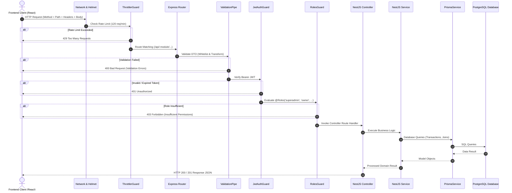

# 🏗️ Étoile Platform — System Architecture & Technology Stack

This document provides an exhaustive technical analysis of the Étoile Ballet Academy digital architecture, detailing the design patterns, runtime topologies, state management frameworks, security enforcement layers, hardware peripherals, and communications infrastructure that compose the platform.

---

## 1. High-Level Architectural Topology

The Étoile platform is engineered around a **Decoupled Dual-Portal Architecture** supported by a single, monolithic, highly modular **NestJS Core REST Engine** backed by a **PostgreSQL relational database**.

```mermaid
graph TB
    subgraph Users ["User Endpoints"]
        PublicUser["Public Visitors & Prospective Dancers"]
        StudentUser["Enrolled Dancers & Parents"]
        InstructorUser["Ballet Instructors & Faculty"]
        AdminUser["Receptionists, Owners & Superadmins"]
    end

    subgraph Portals ["Frontend Presentation Tier (React + Vite)"]
        ClientApp["Client Portal (:5173)\n- Landing Page & Aurora Floating Header\n- Stage Atmosphere Particle Canvas\n- Onboarding Stepper\n- Classes Catalog & Program Modals\n- Student Portal & Barcode ID\n- Instructor Portal & Timetables"]
        AdminApp["Admin & Operations Portal (:5174)\n- Executive Dashboard & Analytics Hub\n- Fast-Track Check-In & Offline Queue\n- Studio Schedule Board & Conflict Guard\n- Academy Hierarchy (Categories/Groups/Sessions)\n- Student CRM & Admissions Pipeline\n- Packages, POS Boutique & Financials\n- WhatsApp Dispatcher & Website CMS\n- Blog, Growth, Staff Roster, Audit Logs & Settings"]
    end

    subgraph Peripherals ["Hardware & Browser APIs"]
        HIDScanner["USB HID Barcode / RFID Readers"]
        CameraQR["WebRTC Video Camera QR Scanner"]
        WebAudio["Web Audio API Synthesizer (Chimes)"]
        CanvasRenderer["HTML5 Canvas Code128 / QR Renderer"]
        OfflineStorage["LocalStorage Queue & PWA Service Worker"]
    end

    subgraph BackendGateway ["NestJS Monolithic REST Core (:3001/api)"]
        HelmetMW["Helmet Security Headers"]
        CorsMW["Dynamic CORS Origin Policy"]
        ThrottleGuard["ThrottlerGuard (Rate Limiting)"]
        ValPipe["ValidationPipe (Whitelist & Type Transform)"]
        JwtAuthGuard["JwtAuthGuard (Passport JWT)"]
        RolesGuard["RolesGuard (RBAC Enforcer)"]
    end

    subgraph Modules ["NestJS Domain Modules (22 Modules)"]
        AuthMod["AuthModule (Unified Student/Parent/Staff)"]
        AttMod["AttendanceModule (Geofence & Dedupe)"]
        StudMod["StudentsModule (CRM & Directory)"]
        SubMod["SubscriptionsModule (IFRS-15 Quotas)"]
        CrsMod["CoursesModule (Timetable Scheduler)"]
        AcadMod["AcademyModule (Categories & Groups)"]
        PosMod["PosModule (Boutique & Variant Inventory)"]
        AccMod["AccountingModule (General Ledger & PnL)"]
        PayMod["PaymentsModule (Paymob/Fawry/InstaPay)"]
        EtaMod["EtaModule (Egyptian Tax Authority)"]
        AnalytMod["AnalyticsModule (BI & Forecasting)"]
        OpsMod["OpsModule (Renewal Watchlist & Conflicts)"]
        BranchMod["BranchesModule (Zamalek/New Cairo & Terms)"]
        WaMod["OpenWaModule (WhatsApp Gateway Bridge)"]
        CmsMod["ContentModule (Dynamic Headless CMS)"]
        LeadMod["LeadsModule (Admissions Pipeline)"]
        BlogMod["BlogModule (Conservatory Press & News)"]
        RostMod["RosterModule (Staff Shifts & Leaves)"]
        RefMod["ReferralsModule (Loyalty & Growth)"]
    end

    subgraph Persistence ["Persistence & External Services"]
        PrismaService["Prisma ORM Client (56 Models)"]
        PostgresDB[(PostgreSQL 16 Engine)]
        WhatsAppGateway["External Baileys / OpenWA HTTP Bridge"]
        PaymentGateways["Paymob / Fawry / InstaPay Gateways"]
        TaxAuthority["ETA eReceipt Sandbox/Production Portal"]
    end

    PublicUser --> ClientApp
    StudentUser --> ClientApp
    InstructorUser --> ClientApp
    AdminUser --> AdminApp

    ClientApp --> CanvasRenderer
    ClientApp --> AtmosphereCanvas
    AdminApp --> HIDScanner
    AdminApp --> CameraQR
    AdminApp --> WebAudio
    ClientApp --> WebAudio
    AdminApp --> OfflineStorage

    ClientApp -->|HTTP / JSON (Bearer JWT)| BackendGateway
    AdminApp -->|HTTP / JSON (Bearer JWT)| BackendGateway

    BackendGateway --> HelmetMW --> CorsMW --> ThrottleGuard --> ValPipe --> JwtAuthGuard --> RolesGuard
    RolesGuard --> Modules
    Modules --> PrismaService
    PrismaService --> PostgresDB
    WaMod -.->|HTTP Webhook / REST| WhatsAppGateway
    PayMod -.->|REST / Webhooks| PaymentGateways
    EtaMod -.->|REST / Signed Invoices| TaxAuthority
```

---

## 2. Technology Stack Breakdown

### Frontend Tier (Client & Admin Portals)
- **Runtime & Build Tool**: [Node.js](https://nodejs.org) + [Vite 5](https://vitejs.dev/) with ES Modules for sub-second Hot Module Replacement (HMR). Code-splitting with `React.lazy` and `Suspense` keeps initial bundles ~105 kB with on-demand chunk loading (20-95 kB per tab).
- **Core Library**: [React 18](https://react.dev/) using functional components with strict TypeScript (`.tsx`).
- **Styling & Design System**: [Tailwind CSS 3](https://tailwindcss.com/) extended with an editorial conservatory palette (Paris Gold `#caa868`, Noir `#080a0b`, Slate Velvet `#111417`, Cream `#f5eedc`).
- **Visual & Atmospheric FX**: Glassmorphism (`backdrop-blur-md`, subtle golden borders), floating pill navigation, interactive canvas stage particle atmosphere (`StageAtmosphereCanvas.tsx`), and smooth state transitions.
- **Typography**: Editorial serif headings (`font-heading`: Cormorant Garamond / Playfair Display) paired with clean sans-serif bodies (`font-sans`: Inter / Cairo / Tajawal).
- **Iconography**: [Lucide React](https://lucide.dev/) (consistent stroke width and vector aesthetics).
- **State Management**: Dedicated React Context Providers (`AppContext` for Client, `AdminContext` for Admin) featuring optimistic updates, API synchronization, and offline fallback resiliency.
- **Offline & Queue Synchronization**: LocalStorage-backed offline queue (`offlineQueue.ts`) capturing check-ins with client-generated UUID idempotency keys during reception connectivity loss; auto-flushes every 8 seconds upon network recovery.
- **Audio Synthesis**: Native browser **Web Audio API** oscillator synthesizing bell chimes for check-in kiosk feedback without audio asset latency.
- **Barcode & QR Rendering**: Native HTML5 Canvas rendering for Code128 standard barcodes and QR codes with download and print capabilities.

### Backend Tier (Core REST API Engine)
- **Framework**: [NestJS 10](https://nestjs.com/) utilizing standard TypeScript decorators, inversion-of-control (IoC) containers, and modular domain architecture (22 domain feature modules).
- **Security Middleware**:
  - `helmet`: Custom HTTP security headers and Cross-Origin Resource Policies.
  - `@nestjs/throttler`: Rate-limiting guard defending endpoints against brute-force attacks (120 requests/minute default threshold; sensitive auth routes budget 60/min login, 10/min OTP request, 30/min OTP verify).
  - `@nestjs/passport` & `passport-jwt`: Stateless JSON Web Token authentication strategy with opaque rotating refresh tokens.
  - `argon2`: Password hashing algorithm providing memory-hard protection against ASIC/GPU cracking.
- **Data Validation**: `class-validator` and `class-transformer` combined with global `ValidationPipe({ whitelist: true, transform: true })`.
- **Concurrency & Process Management**: Root orchestration via `concurrently` enabling unified single-command development (`npm run dev`).

### Database & Persistence Tier
- **Database Engine**: [PostgreSQL 16](https://www.postgresql.org/) relational database running on standard port `5432`.
- **Object-Relational Mapping (ORM)**: [Prisma ORM 6](https://www.prisma.io/) handling declarative schema definitions, versioned migrations (`npx prisma migrate deploy`), type-safe query generation, relation joins, and idempotent seed scripts.
- **Data Seeding Engine**: `server/prisma/seed.ts` providing realistic conservatory entities across 56 models: staff, families, dancers, multi-tier subscription plans, products with size variants, branches (`Zamalek`, `New Cairo`), academic years, courses, categories, groups, scheduled sessions, double-entry vouchers, and CMS presets.

---

## 3. Frontend Architecture & State Management

### 3.1 Dual-Portal Decoupling Strategy
The platform avoids bloated single-bundle applications by deploying two distinct Vite SPAs:

1. **Client & Student Portal (`/client`, Port `5173`)**:
   - **Audience**: General public, prospective students, enrolled dancers, parents, and instructors.
   - **Key Components & Views**:
     - `AppHeader`: Modern floating glassmorphic aurora navigation bar, dynamic scroll responsiveness, golden status badges, and mobile drawer.
     - `StageAtmosphereCanvas`: Interactive canvas particle simulation evoking theatre stage dust and spotlights.
     - `LandingPage`: Editorial conservatory showcase driven by dynamic CMS content.
     - `OnboardingChecklist`: Step-by-step interactive onboarding stepper guiding dancers and parents through card verification, password setup, curriculum exploration, and WhatsApp joining.
     - `ClassesCatalogPage`: Interactive curriculum catalog with category filters, schedule grids, and direct enrollment triggers.
     - `ClientPortal`: Authenticated student & family dashboard displaying real-time attendance countdowns, remaining subscription quotas, wallet balances, medical notes, and a digital ID card with barcode.
     - `InstructorPortal`: Authenticated pedagogical dashboard showing assigned courses, student attendance counts, and 1-click WhatsApp session reminder dispatches.
     - `ClientLoginPage`: Multi-modal authentication supporting physical card scan, student ID, registered parent email/phone with student password, demo quick-fill drawer, and first-time WhatsApp temporary password setup.

2. **Admin & Operations ERP (`/admin`, Port `5174`)**:
   - **Audience**: Artistic Directors, Academy Owners, Receptionists, and Department Heads.
   - **Key Views (22 Operational Modules)**:
     - `DashboardOverview`: Live KPIs, occupancy gauges, attendance sparklines, needs-attention renewal queue, and a live Paris Conservatory clock.
     - `AnalyticsHub`: Business intelligence dashboard with revenue trends, program mix distribution, forecasting (M+1..3), and attention watchlists.
     - `FastTrackCheckIn`: High-throughput scanner kiosk with USB barcode, camera QR, audio chimes, premise WiFi verification, and offline queue synchronization.
     - `ScheduleBoard`: Studio week grid, room occupancy, today's timeline, and automated double-booking conflict detection (`/api/ops/schedule-conflicts`).
     - `AcademyView`: Hierarchical 3-step conservatory structure: Categories › Groups › Sessions with assigned lead instructors.
     - `StudentCrm` & `StudentProfilePage`: Comprehensive dancer CRM, admissions Kanban, medical notes, skill evaluation rubrics, and wallet debt adjustments.
     - `AdmissionsPipeline`: Dedicated admissions board managing inquiries, trial classes, auditions, and 1-click student conversion.
     - `SubscriptionManager`: Subscription plan creation, manual quota overrides, and daily accrual recognition simulation.
     - `PosBoutique`: Retail store with inventory variant tracking, barcode SKU matching, and multi-tender checkout.
     - `FinancialAccounting`: Full financial suite including IFRS-15 daily accruals, P&L, AR aging, expense approvals, instructor payroll, journal vouchers, cash drawer shift reconciliation, payment links, and ETA tax receipts.
     - `OpenWaDispatcher`: Real-time WhatsApp gateway status, QR pairing, automated message templates, and audit log.
     - `PortalCmsEditor`: Live visual CMS for academy branding, hero copy, faculty bios, performances, and announcement alerts.
     - `BlogManager`: Conservatory news, press releases, and articles publishing manager.
     - `GrowthView`: Referral codes, promo codes, student discounts, and acquisition tracking.
     - `RosterView`: Staff shift scheduling, front-desk duty allocation, and leave request management.
     - `AuditLogView`: System security, CRM, financial, and attendance event auditing.
     - `AdminUsersManagement`: Staff user creation, RBAC role assignment, card code binding, shift status, and password resets.
     - `SettingsHub`: Multi-campus configuration (`Zamalek`, `New Cairo`), academic year management, ETA tax credentials, and payment gateway toggles.
     - `MyProfilePage`: Personal staff credentials, security settings, and duty status.

### 3.2 State Management & Offline Resiliency
Both portals leverage custom React Context engines that provide:
- **Synchronized State**: Centralized reactive state for entities (students, courses, sessions, products, invoices, attendance).
- **Graceful Degradation / Offline Resiliency**: Every state action first attempts a REST API call to the NestJS backend. If the backend is unreachable, the context gracefully falls back to local memory state and mock data, displaying a clear `Live server / Local projection` indicator.
- **Offline Check-In Queue**: Kiosk scans offline are saved to `localStorage` with UUID idempotency keys. As soon as connectivity returns, the queue flushes automatically every 8 seconds without duplicate quota deductions.
- **Global Toast Notification System**: Standardized toast triggers across portals (`gold`, `success`, `warning`, `error`).
- **Live Paris Conservatory Clock**: Synchronized European/Paris (`Europe/Paris`) time display for accurate session tracking.
- **Keyboard Shortcuts**: Power-user navigation (`Cmd/Ctrl+B` to collapse/expand sidebar, keys `1`-`8` to switch allowed modules).

---

## 4. Backend Architecture & Request Lifecycle

The NestJS backend implements an enterprise layered architecture where every HTTP request traverses a defined pipeline:



---

## 5. Security & Role-Based Access Control (RBAC)

### 5.1 Password Hashing with Argon2
Unlike standard bcrypt which can be vulnerable to GPU hash cracking, Étoile uses **Argon2id** (`argon2.hash()`, `argon2.verify()`), the winner of the Password Hashing Competition. All staff and student passwords stored in the database are protected with memory-hard hashes.

### 5.2 Short-Lived JWT Access + Rotating Refresh Tokens
- **Token Generation**: Upon successful authentication, the server issues a short-lived JWT access token (30 minutes via `ACCESS_TOKEN_TTL`) plus an opaque, single-use refresh token (30 days via `REFRESH_TOKEN_TTL`), whose SHA-256 hash is persisted in `RefreshToken`. Payload contains:
  - `sub`: User ID
  - `email` or `barcode`: Principal identifier
  - `role`: Staff role (`superadmin`, `owner`, `receptionist`, `instructor`) or `student`
  - `type` / `familyId` / `studentId`: Portal session scoping claims
  - `name`: User display name
- **Unified Student & Parent Authentication**:
  - Legacy passwordless family login (`/api/auth/family/login`) and family PIN endpoints have been permanently deprecated and removed.
  - Students and instructors authenticate via smart card barcode or staff credentials.
  - Parents authenticate directly using their dancer's credentials: student card barcode (`ETOILE-XXXXXX`), student ID (`STU-XXX`), registered parent email, or registered parent phone, paired with the student's private password.
  - The returned session token loads both dancer progress and linked `Family` household data (billing, invoices, siblings, timetable) securely.
- **Rotation & Reuse Detection**: Each `POST /api/auth/refresh` revokes the presented token and mints a fresh pair. Re-presenting an already-rotated token is treated as theft: all tokens of that subject are revoked (`401`).
- **Account & OTP Lockout Protection**:
  - 10 incorrect password attempts trigger a 15-minute account lockout (`429 Too Many Requests`), surviving IP rotation.
  - 5 incorrect OTP verifications lock the OTP for 15 minutes.
- **Single-Purpose Setup Tokens**: First-login temporary tokens carry `mustChangePassword: true` and are rejected by every guarded endpoint until the password is changed.
- **Guards**: Protected endpoints utilize `@UseGuards(JwtAuthGuard, RolesGuard)` alongside `@Roles(...)`; `superadmin` and `owner` hold universal access. Public catalog/schedule reads use `OptionalJwtAuthGuard` (anonymous allowed, contacts redacted).
- **Boot Guarantee**: The API refuses to start in production without a strong (`≥32 chars`) `JWT_SECRET`.

### 5.3 RBAC Permission Matrix

| Module / Action | Superadmin | Owner | Receptionist | Instructor | Client (Student / Parent) |
| :--- | :---: | :---: | :---: | :---: | :---: |
| **View Public Landing / Catalog** | ✅ | ✅ | ✅ | ✅ | ✅ |
| **Student Portal & Barcode ID** | ✅ | ✅ | ✅ | ✅ | ✅ (Own Household Only) |
| **Instructor Portal & Schedule** | ✅ | ✅ | ✅ | ✅ (Own Only) | ❌ |
| **Kiosk Check-In Processing** | ✅ | ✅ | ✅ | ✅ | ✅ (Own Household Only) |
| **Analytics & Intelligence Hub** | ✅ | ✅ | ✅ | ✅ | ❌ |
| **Studio Schedule & Conflicts** | ✅ | ✅ | ✅ | ✅ | ❌ |
| **Academy Categories & Groups** | ✅ | ✅ | ✅ | ❌ | ❌ |
| **Student CRM & Directory** | ✅ | ✅ | ✅ | ✅ (View Only) | ❌ |
| **Admissions Lead Conversion** | ✅ | ✅ | ✅ | ❌ | ❌ |
| **Packages & Quota Overrides** | ✅ | ✅ | ✅ | ❌ | ❌ |
| **POS Boutique Checkout** | ✅ | ✅ | ✅ | ❌ | ✅ (Own Household Only) |
| **Financial P&L & Balance Sheet** | ✅ | ✅ | ❌ | ❌ | ❌ |
| **Invoices & AR Management** | ✅ | ✅ | ✅ | ❌ | ❌ |
| **Online Pay-Links Creation** | ✅ | ✅ | ✅ | ❌ | ❌ |
| **ETA Electronic Invoicing** | ✅ | ✅ | ❌ | ❌ | ❌ |
| **Expense Recording & Approvals** | ✅ | ✅ | ❌ | ❌ | ❌ |
| **Instructor Payroll & Payment** | ✅ | ✅ | ❌ | ❌ | ❌ |
| **Double-Entry Journal Vouchers** | ✅ | ✅ | ❌ | ❌ | ❌ |
| **Cash Drawer Shifts Management**| ✅ | ✅ | ✅ | ❌ | ❌ |
| **WhatsApp Gateway Configuration**| ✅ | ✅ | ✅ | ❌ | ❌ |
| **Portal CMS Dynamic Editing** | ✅ | ✅ | ❌ | ❌ | ❌ |
| **Blog & Press Management** | ✅ | ✅ | ❌ | ❌ | ❌ |
| **Staff Roster & Shifts** | ✅ | ✅ | ✅ | ❌ | ❌ |
| **Security & CRM Audit Logs** | ✅ | ✅ | ❌ | ❌ | ❌ |
| **Staff Accounts & Role Mod** | ✅ | ✅ | ❌ | ❌ | ❌ |
| **Multi-Campus & Branch Settings**| ✅ | ✅ | ❌ | ❌ | ❌ |

---

## 6. Hardware & Physical Peripherals Integration

### 6.1 Hardware Barcode & RFID Scanners
The `FastTrackCheckIn` kiosk supports physical hardware barcode scanners (Opticon, Honeywell, Zebra) operating in **USB HID Keyboard Emulation Mode**:
- A global keydown listener buffers rapid keystrokes (< 50ms interval between characters).
- When a terminating `Enter` key is detected, the buffer is evaluated against the student barcode pattern (`ETOILE-XXXXXX` or numeric standard).
- The kiosk instantly triggers check-in verification without requiring the operator to focus an input field.

### 6.2 WebRTC Camera QR Scanner
For devices without dedicated hardware scanners (tablets, mobile phones, laptops), the kiosk includes a video stream scanner:
- Uses the device's camera stream via `navigator.mediaDevices.getUserMedia()`.
- Captures and scans frames for QR codes containing encrypted student authentication tokens or barcodes.

### 6.3 Native Web Audio API Sound Synthesizer
Rather than relying on audio file downloads (`.mp3` / `.wav`) that introduce network latency or fail when offline, the platform synthesizes rich audio chimes directly in code using the browser's native `AudioContext`:
- **Granted / Success Chime**: Multi-frequency harmonic chord ($C_5 \rightarrow E_5 \rightarrow G_5 \rightarrow C_6$) using sine oscillators with exponential volume decay.
- **Denied / Quota Expired Chime**: Low dissonance tone ($F_3 \rightarrow D_3^\sharp$) indicating quota exhaustion or expired dates.
- **Warning Chime**: Rapid double-beep alert for negative wallet balances or attendance warnings.

### 6.4 WiFi Premise Geofencing & BSSID Verification
To ensure students can only check in while physically present inside the conservatory premises:
- The check-in payload validates against the conservatory's authorized Access Point BSSID (`Etoile-Secure-5G [F4:92:BF:11:80:A2]`).
- Any attempt to forge check-in outside the facility flags `premiseVerified: false` and can be configured to block access.

---

## 7. Automated WhatsApp Gateway & Notification Engine

The platform incorporates an enterprise notification subsystem that bridges academy events to parent and instructor WhatsApp accounts:

### 7.1 Operating Modes
1. **Built-in QR Engine (`builtin_qr`)**:
   - Generates an in-browser QR code for direct pairing with WhatsApp Web.
   - Ideal for standalone conservatory reception tablets and direct device pairing.
2. **External Gateway Bridge (`external_gateway`)**:
   - Integrates via REST webhooks with an external Baileys, WhatsApp Business Cloud API, or OpenWA server running on a local or dedicated microservice.

### 7.2 Dynamic Templating Engine
Automated notifications utilize dynamic token replacement:
- `{studentName}`: Dancer's full name.
- `{courseTitle}`: Scheduled class title.
- `{time}`: Class start time.
- `{studio}`: Designated studio hall (e.g., *Grand Studio Petipa*, *Studio Pavlova*).
- `{instructorName}`: Assigned ballet master.
- `{quotaRemaining}`: Classes left in current subscription package.
- `{walletBalance}`: Current student balance or outstanding tuition debt.

### 7.3 Automated Trigger Events
- **Class Check-In Confirmation**: Dispatches an instant receipt to parents as soon as the student scans their badge at the front desk.
- **Pre-Session Class Reminder**: A scheduled background job triggers automated class reminders (configurable from 15 to 120 minutes before class).
- **Low Quota Warning**: Dispatched automatically when a dancer reaches 2 or fewer remaining classes.
- **Debt & Tuition Alert**: Dispatched when student balance enters negative debt exceeding safety thresholds.

---

## 8. Internationalization & Bidirectional Layout (EN / AR)

Étoile provides comprehensive **bilingual support** supporting international conservatories operating in Paris, London, Cairo, and Dubai:
- **Language Detection & Persistence**: Selected language (`en` or `ar`) persists in `localStorage`.
- **Directional Switching**: Dynamic `dir="ltr"` and `dir="rtl"` attribute application on root elements.
- **Typography Switching**: LTR typography utilizes French-inspired serif Cormorant Garamond, whereas RTL automatically mirrors layout using refined Arabic typography (Cairo and Tajawal).
- **Mirrored Layouts**: Flexbox, grid columns, chevron orientations, and badge alignments automatically invert for natural right-to-left reading flow.
- **Localized Data Schema**: All course titles, descriptions, staff names, department names, and product names possess both English and Arabic counterparts in the database (`title` and `titleAr`, `name` and `nameAr`).
