# 🗄️ Étoile Platform — Database Schema & Data Dictionary

This document serves as the canonical reference for the Étoile Ballet Academy PostgreSQL database, maintained and managed via **Prisma ORM**. It details all entities, relationships, field constraints, indexing strategies, cascade rules, and domain-specific enumerations.

---

## 1. Entity-Relationship Diagram (ERD)

```mermaid
erDiagram
    STAFF_USER ||--o{ COURSE : "instructs"
    STAFF_USER ||--o{ COURSE_SESSION : "leads"
    STAFF_USER ||--o{ STAFF_SHIFT : "works"
    STAFF_USER ||--o{ STAFF_LEAVE : "requests"
    
    BRANCH ||--o{ COURSE : "hosts"
    ACADEMIC_YEAR ||--o{ COURSE : "calendars"

    CATEGORY ||--o{ GROUP : "contains"
    GROUP ||--o{ COURSE_SESSION : "schedules"
    GROUP ||--o{ GROUP_ENROLLMENT : "enrolls"
    STUDENT ||--o{ GROUP_ENROLLMENT : "attends"
    
    FAMILY ||--o{ STUDENT : "encompasses"
    FAMILY ||--o{ INVOICE : "billed_to"
    FAMILY ||--o{ REFERRAL : "refers"
    
    STUDENT ||--o{ STUDENT_SUBSCRIPTION : "holds"
    STUDENT ||--o{ ATTENDANCE_RECORD : "logs"
    STUDENT ||--o{ STUDENT_NOTE : "receives"
    STUDENT ||--o{ SKILL_EVALUATION : "evaluated_in"
    STUDENT ||--o{ BOUTIQUE_ORDER : "places"
    STUDENT ||--o{ INVOICE : "billed_for"
    STUDENT ||--o{ PAYMENT_TRANSACTION : "makes"
    STUDENT ||--o{ COURSE_ENROLLMENT : "participates_in"
    STUDENT ||--o{ PAYMENT_LINK : "pays_via"
    
    SUBSCRIPTION_PLAN ||--o{ STUDENT_SUBSCRIPTION : "instantiates"
    
    COURSE ||--o{ COURSE_ENROLLMENT : "enrolled_students"
    COURSE ||--o{ COURSE_SESSION : "scheduled_classes"
    
    PRODUCT ||--o{ PRODUCT_VARIANT : "has_sizes"
    PRODUCT ||--o{ ORDER_ITEM : "ordered_in"
    
    BOUTIQUE_ORDER ||--o{ ORDER_ITEM : "contains"
    
    INVOICE ||--o{ INVOICE_LINE_ITEM : "itemized_in"
    INVOICE ||--o{ PAYMENT_TRANSACTION : "settled_by"
    INVOICE ||--o{ ETA_DOCUMENT : "certified_by"
    INVOICE ||--o{ PAYMENT_LINK : "generated_for"
    
    CASH_DRAWER_SHIFT ||--o{ PAYMENT_TRANSACTION : "accumulates"
    JOURNAL_ENTRY ||--o{ JOURNAL_ENTRY_LINE : "composed_of"
```

---

## 2. Core Entities & Data Dictionary

### 2.1 Staff & Authentication: `StaffUser`
Represents administrative, pedagogical, and operational personnel in the academy.

| Field Name | Type | Modifiers | Description |
| :--- | :--- | :--- | :--- |
| `id` | `String` | `@id @default(cuid())` | Unique internal identifier |
| `email` | `String` | `@unique` | Professional email login identifier |
| `name` | `String` | Required | English display name |
| `nameAr` | `String?` | Optional | Arabic display name |
| `role` | `String` | `@default("receptionist")` | Role: `superadmin`, `owner`, `receptionist`, `instructor` |
| `department` | `String` | `@default("Operations")` | Administrative or pedagogical department (EN) |
| `departmentAr` | `String?` | `@default("العمليات")` | Administrative or pedagogical department (AR) |
| `avatarUrl` | `String?` | Optional | Profile avatar image link |
| `passwordHash`| `String` | Required | Argon2id cryptographic password hash |
| `cardCode` | `String?` | `@unique` | Physical RFID or barcode identification card code |
| `phone` | `String?` | Optional | Mobile number for SMS/WhatsApp verification |
| `isFirstLogin`| `Boolean` | `@default(false)` | Flag forcing password setup on initial access |
| `otpCode` | `String?` | Optional | Ephemeral OTP for password recovery |
| `otpExpiresAt`| `DateTime?`| Optional | Expiration timestamp of the active OTP |
| `otpAttempts` | `Int` | `@default(0)` | Failed OTP verifications in the current window (locks at 5) |
| `otpLockedUntil` | `DateTime?` | Optional | OTP lockout expiry after brute-force threshold |
| `failedLoginAttempts` | `Int` | `@default(0)` | Failed password logins (locks at 10; cleared on success) |
| `loginLockedUntil` | `DateTime?` | Optional | Account lockout expiry after brute-force threshold |
| `shiftActive` | `Boolean` | `@default(false)` | Flag indicating if staff member is on active duty |
| `createdAt` | `DateTime`| `@default(now())` | Record creation timestamp |
| `updatedAt` | `DateTime`| `@updatedAt` | Automatic last modification timestamp |

---

### 2.2 Family Household: `Family`
Groups multiple students under a single parent/guardian account for billing, communications, and referral tracking.

| Field Name | Type | Modifiers | Description |
| :--- | :--- | :--- | :--- |
| `id` | `String` | `@id` | Human-readable identifier (e.g., `FAM-01`) |
| `parentName` | `String` | Required | Name of the primary parent/guardian |
| `parentPhone`| `String` | Required | Primary phone number for WhatsApp receipts |
| `parentEmail`| `String` | Required | Billing and correspondence email |
| `referralCode`| `String?`| `@unique` | Unique student/family referral invite code |
| `pinHash` | `String?` | Optional | *(Legacy / Deprecated)* Family login now unified with student credentials |
| `createdAt` | `DateTime`| `@default(now())` | Record creation timestamp |
| `updatedAt` | `DateTime`| `@updatedAt` | Automatic last modification timestamp |

---

### 2.3 Student Dancer: `Student`
Central student entity tracking profile, credentials, financial balance, and pedagogical progress.

| Field Name | Type | Modifiers | Description |
| :--- | :--- | :--- | :--- |
| `id` | `String` | `@id` | Primary identifier (e.g., `STU-001`) |
| `name` | `String` | Required | English full name |
| `nameAr` | `String` | Required | Arabic full name |
| `barcode` | `String` | `@unique` | Unique Code128 barcode number (e.g., `ETOILE-892101`) |
| `photoUrl` | `String` | Required | Profile photography URL |
| `familyId` | `String` | `FK -> Family.id` | Relationship to primary household (`onDelete: Cascade`) |
| `age` | `Int` | Required | Dancer age in years |
| `birthDate` | `DateTime?`| Optional | Dancer date of birth |
| `program` | `String` | Required | Academy curriculum: `classical`, `contemporary`, `youth` |
| `level` | `String` | Required | Conservatory level (e.g., *Pre-Professional Level IV*) |
| `walletBalance`| `Decimal` | `@default(0.0) @db.Decimal(12, 2)` | Current account balance; negative values indicate debt |
| `maxNegativeDebt`| `Decimal` | `@default(150.0) @db.Decimal(12, 2)` | Maximum allowed overdraft before kiosk check-in denial |
| `parentName` | `String` | Required | Cached parent name for rapid kiosk lookup |
| `parentPhone`| `String` | Required | Cached WhatsApp contact phone |
| `parentEmail`| `String` | Required | Cached correspondence email |
| `passwordHash`| `String?`| Optional | Argon2id hash for student & parent portal authentication |
| `isFirstLogin`| `Boolean` | `@default(true)` | Flag requiring first-time password setup via WhatsApp |
| `otpCode` | `String?` | Optional | Ephemeral password reset OTP |
| `otpExpiresAt`| `DateTime?`| Optional | Password reset OTP expiration |
| `otpAttempts` | `Int` | `@default(0)` | Failed OTP verifications in the current window (locks at 5) |
| `otpLockedUntil` | `DateTime?` | Optional | OTP lockout expiry after brute-force threshold |
| `failedLoginAttempts` | `Int` | `@default(0)` | Failed password logins (locks at 10; cleared on success) |
| `loginLockedUntil` | `DateTime?` | Optional | Account lockout expiry after brute-force threshold |
| `createdAt` | `DateTime`| `@default(now())` | Registration timestamp |
| `updatedAt` | `DateTime`| `@updatedAt` | Last profile update timestamp |

---

### 2.4 Subscription Plans & Quotas: `SubscriptionPlan` & `StudentSubscription`

#### `SubscriptionPlan`
Pre-configured class package templates offered by the academy.

| Field Name | Type | Modifiers | Description |
| :--- | :--- | :--- | :--- |
| `id` | `String` | `@id` | Plan code (e.g., `PLAN-PRE-PRO`) |
| `name` | `String` | Required | English plan title |
| `nameAr` | `String` | Required | Arabic plan title |
| `program` | `String` | Required | Target program (`classical`, `contemporary`, `youth`) |
| `maxSessions` | `Int` | Required | Number of classes included in the package |
| `durationDays`| `Int` | `@default(30)` | Validity period in days from purchase |
| `price` | `Float` | Required | Base price in academy currency |
| `description` | `String?` | Optional | Description of training privileges |
| `active` | `Boolean` | `@default(true)` | Whether the plan is currently offered |
| `createdAt` | `DateTime`| `@default(now())` | Plan creation date |

#### `StudentSubscription`
Instantiated subscription contract assigned to a specific student.

| Field Name | Type | Modifiers | Description |
| :--- | :--- | :--- | :--- |
| `id` | `String` | `@id @default(cuid())` | Unique contract identifier |
| `studentId` | `String` | `FK -> Student.id` | Associated student (`onDelete: Cascade`) |
| `planId` | `String?` | `FK -> SubscriptionPlan.id`| Source plan template (nullable) |
| `planName` | `String` | Required | Snapshot of plan name at time of sale |
| `planNameAr` | `String` | Required | Arabic snapshot of plan name |
| `startDate` | `DateTime`| Required | Contract activation date |
| `endDate` | `DateTime`| Required | Contract expiration date |
| `maxSessions` | `Int` | Required | Total allocated sessions |
| `usedSessions`| `Int` | `@default(0)` | Number of sessions redeemed through check-ins |
| `price` | `Float` | Required | Actual purchase price paid |
| `dailyAccrualRate`| `Float` | `@default(0.0)` | Prorated daily revenue recognition rate ($\frac{P}{T_{days}}$) |
| `status` | `String` | `@default("active")` | Status: `active`, `expired_quota`, `expired_date` |
| `createdAt` | `DateTime`| `@default(now())` | Enrollment date |
| `updatedAt` | `DateTime`| `@updatedAt` | Last modification date |

---

### 2.5 Attendance Tracking: `AttendanceRecord`
Immutable ledger entry created upon every kiosk check-in attempt.

| Field Name | Type | Modifiers | Description |
| :--- | :--- | :--- | :--- |
| `id` | `String` | `@id @default(cuid())` | Unique audit record identifier |
| `studentId` | `String` | `FK -> Student.id` | Checked-in student (`onDelete: Cascade`) |
| `studentName` | `String` | Required | Cached student name for audit speed |
| `barcode` | `String` | Required | Barcode scanned at kiosk |
| `timestamp` | `DateTime`| `@default(now())` | Exact check-in timestamp |
| `classTitle` | `String` | Required | Associated scheduled ballet class |
| `verifiedMethod`| `String` | `@default("hid_barcode")`| Input device: `hid_barcode`, `qr_camera`, `manual` |
| `premiseVerified`| `Boolean`| `@default(true)` | Premise validation result |
| `wifiBssid` | `String` | Required | Network BSSID of the check-in terminal |
| `status` | `String` | `@default("granted")` | Access decision: `granted`, `denied_expired`, `denied_quota` |
| `quotaRemaining`| `Int` | Required | Remaining sessions snapshot after deduction |

---

### 2.6 Courses & Timetables: `Course`, `CourseEnrollment`, `CourseSession`

#### `Course`
Defines recurring ballet curriculum courses.

| Field Name | Type | Modifiers | Description |
| :--- | :--- | :--- | :--- |
| `id` | `String` | `@id @default(cuid())` | Internal course identifier |
| `code` | `String` | `@unique` | Official course code (e.g., `BAL-CL-101`) |
| `title` | `String` | Required | Course name in English |
| `titleAr` | `String?` | Optional | Course name in Arabic |
| `description` | `String?` | Optional | Detailed curriculum description (EN) |
| `descriptionAr`| `String?`| Optional | Detailed curriculum description (AR) |
| `program` | `String` | Required | Program: `classical`, `contemporary`, `youth` |
| `level` | `String` | Required | Target level: `pre-pro`, `conservatory`, `beginner` |
| `capacity` | `Int` | `@default(20)` | Maximum student enrollment capacity |
| `instructorId`| `String?` | `FK -> StaffUser.id`| Lead faculty instructor (`onDelete: SetNull`) |
| `dayOfWeek` | `String?` | Optional | Scheduled days (e.g., `Monday, Wednesday, Friday`) |
| `startTime` | `String?` | Optional | Start time string (e.g., `16:00`) |
| `endTime` | `String?` | Optional | End time string (e.g., `17:30`) |
| `studioRoom` | `String?` | `@default("Studio Petipa")`| Assigned physical dance hall |
| `active` | `Boolean` | `@default(true)` | Active status flag |

#### `CourseEnrollment`
Associates an active student with a course.

| Field Name | Type | Modifiers | Description |
| :--- | :--- | :--- | :--- |
| `id` | `String` | `@id @default(cuid())` | Unique enrollment identifier |
| `courseId` | `String` | `FK -> Course.id` | Associated course (`onDelete: Cascade`) |
| `studentId` | `String` | `FK -> Student.id` | Enrolled student (`onDelete: Cascade`) |
| `enrolledAt` | `DateTime`| `@default(now())` | Enrollment date |
| `status` | `String` | `@default("active")` | Status: `active`, `completed`, `dropped` |

*Unique Constraint*: `@@unique([courseId, studentId])` prevents duplicate enrollments.

#### `CourseSession`
Individual calendar instances of a course.

| Field Name | Type | Modifiers | Description |
| :--- | :--- | :--- | :--- |
| `id` | `String` | `@id @default(cuid())` | Unique session identifier |
| `courseId` | `String` | `FK -> Course.id` | Parent course (`onDelete: Cascade`) |
| `title` | `String` | Required | Repertoire or session focus title |
| `sessionDate` | `DateTime`| Required | Date of the class session |
| `startTime` | `String` | Required | Session start time (`HH:mm`) |
| `endTime` | `String` | Required | Session end time (`HH:mm`) |
| `studioRoom` | `String` | `@default("Studio Petipa")`| Studio room designation |
| `instructorId`| `String?` | `FK -> StaffUser.id`| Teaching faculty instructor |
| `reminderSent`| `Boolean` | `@default(false)` | Flag indicating automated WhatsApp reminder sent |
| `status` | `String` | `@default("scheduled")` | Status: `scheduled`, `completed`, `cancelled` |
| `notes` | `String?` | Optional | Attire or repertoire notes for dancers |

---

### 2.7 Point of Sale Boutique: `Product`, `ProductVariant`, `BoutiqueOrder`, `OrderItem`

#### `Product` & `ProductVariant`
Manages academy dancewear, pointe shoes, and accessories with size-level inventory control.

- **`Product`**:
  - `id`: Unique product ID (e.g., `PROD-01`)
  - `title` & `titleAr`: Bilingual product naming
  - `category`: `pointe_shoes`, `leotards`, `tights`, `apparel`, `accessories`
  - `price`: Standard retail selling price
  - `sku`: Unique stock keeping unit code
  - `imageUrl`: Product showcase image

- **`ProductVariant`**:
  - `id`: Variant identifier
  - `productId`: Parent product (`onDelete: Cascade`)
  - `size`: Sizing designation (e.g., `36 XXX`, `Adult S/M`, `Child L`)
  - `stock`: Available real-time inventory count
  - *Unique Constraint*: `@@unique([productId, size])`

#### `BoutiqueOrder` & `OrderItem`
Records retail sales transactions.

- **`BoutiqueOrder`**:
  - `orderNumber`: Unique readable order code (e.g., `ORD-9821`)
  - `studentId`: Optional customer reference (`onDelete: SetNull`)
  - `customerName`: Buyer name
  - `paymentMethod`: `cash`, `card`, `transfer`, `wallet_debt`
  - `totalAmount`: Total purchase sum
  - `ledgerStatus`: `settled` or `charged_debt`

- **`OrderItem`**:
  - `orderId`: Associated order (`onDelete: Cascade`)
  - `productId`: Referenced catalog product (`onDelete: Restrict`)
  - `title`: Product name snapshot
  - `size`: Selected size variant
  - `price`: Price snapshot per unit
  - `quantity`: Units purchased

---

### 2.8 Financial Accounting Suite Entities

#### `Expense`
Studio operational and pedagogical expenses.
- `expenseNumber`: Unique expense identifier (e.g., `EXP-2026-081`)
- `category`: `studio_rent`, `utilities`, `piano_maintenance`, `costumes_production`, `cleaning_sanitization`, `marketing_social`, `software_licenses`, `administrative_legal`
- `description`: Expense explanation
- `amount` & `vatAmount`: Subtotal and VAT breakdowns
- `total`: Total disbursement
- `vendor`: Payee or service provider
- `paymentMethod`: `bank_transfer`, `petty_cash`, `corporate_card`
- `status`: `approved`, `pending_audit`, `rejected`
- `approvedBy`: Approving administrator

#### `Invoice` & `InvoiceLineItem`
Billing and Accounts Receivable (AR) management.
- `invoiceNumber`: Unique invoice code (e.g., `INV-2026-104`)
- `studentId` & `familyId`: Associated account references
- `issueDate` & `dueDate`: Invoice timeline
- `subtotal`, `taxAmount`, `total`: Financial totals
- `amountPaid`: Cumulative settlement amount
- `remainingDue`: Unsettled balance
- `status`: `unpaid`, `partially_paid`, `paid`, `overdue`, `cancelled`
- `agingBucket`: `current`, `1_30_days`, `31_60_days`, `over_60_days`

#### `PaymentTransaction`
Settlements recorded against invoices or cash shifts.
- `transactionNumber`: Unique receipt number
- `invoiceId`: Settled invoice reference
- `studentId`: Paying student reference
- `amount`: Transaction amount
- `method`: `cash`, `card`, `bank_transfer`, `fawry`, `instapay`
- `receivedBy`: Staff member taking payment
- `shiftId`: Associated open cash drawer shift

#### `PayrollRecord`
Monthly faculty salary and instruction compensation.
- `instructorId`: Associated faculty member
- `month`: Payroll period (e.g., `2026-09`)
- `baseSalary`: Fixed monthly base compensation
- `hourlyRate` & `hoursTaught`: Group classes compensation
- `privateSessionsCount` & `privateSessionRate`: Solo instruction compensation
- `bonuses` & `deductions`: Adjustments
- `netPayable`: Final calculated remuneration
- `status`: `pending`, `processed`, `paid`

#### `JournalEntry` & `JournalEntryLine`
Double-entry general ledger vouchers.
- `voucherNumber`: Unique journal voucher code
- `memo`: Transaction description
- `totalDebit` & `totalCredit`: Balanced ledger totals
- `lines`: Individual debit/credit entries against account codes (`1010 Cash`, `4010 Tuition`, etc.)

#### `CashDrawerShift`
Front-desk cash drawer register management.
- `shiftNumber`: Unique shift code
- `cashierName`: Cashier on duty
- `openingFloat`: Initial cash balance
- `cashSalesTotal` & `cashDrops`: Cash transactions during shift
- `expectedCash`: Calculated cash expectation ($Float + Sales - Drops$)
- `actualCashCounted`: Cash physical count upon shift closure
- `variance`: Discrepancy ($Actual - Expected$)
- `status`: `open` or `closed`

---

### 2.9 Admissions & Student CRM Entities

#### `AdmissionLead`
Prospective dancer inquiries and audition pipeline.
- `dancerName`, `age`, `parentName`, `parentPhone`, `parentEmail`: Contact details
- `program`: Desired discipline (`classical`, `contemporary`, `youth`)
- `stage`: Pipeline stage: `new_inquiry`, `audition_scheduled`, `evaluated`, `enrolled`, `rejected`
- `experience`: Prior ballet training history
- `notes`: Artistic director comments
- `convertedStudentId`: Linked student ID once converted

#### `StudentNote` & `SkillEvaluation`
Pedagogical progress and clinical/artistic evaluation.
- **`StudentNote`**:
  - `author` & `authorRole`: Note author
  - `category`: `general`, `medical`, `tuition`, `performance`
  - `text`: Detailed note content
- **`SkillEvaluation`**:
  - `evaluator`: Master instructor name
  - Scores: `barre`, `center`, `allegro`, `musicality` (scale 0.0 to 10.0)
  - `notes`: Performance feedback

---

### 2.10 Communications, Auditing & CMS Configuration

#### `PortalContentStore`
Stores the dynamic JSON document driving public landing page content (`hero`, `branding`, `faculty`, `programs`, `performances`, `notice`).

#### `WhatsAppReminderConfig` & `WhatsAppGatewayConfig`
Maintains operational settings for automated pre-session WhatsApp notifications:
- `sendMinutesBefore`: Minutes prior to class when notifications dispatch (e.g., 60 minutes)
- `studentTemplateEn` / `studentTemplateAr`: Bilingual notification templates for students
- `instructorTemplateEn` / `instructorTemplateAr`: Bilingual notification templates for faculty
- `gatewayUrl`, `apiKey`, `sessionName`, `status`: Gateway connectivity parameters
- `autoCron`: Automated reminder scheduler flag

#### `OpenWaLog`
Chronological dispatch log of all outbound automated and manual WhatsApp notifications.
- `id`: Unique log identifier (`cuid()`)
- `recipientPhone`: Mobile recipient number with international country code
- `recipientName`: Dancer, parent, or faculty recipient name
- `triggerEvent`: Dispatch trigger event (`checkin_receipt`, `session_reminder`, `password_otp`, `manual_dispatch`, `course_broadcast`)
- `language`: Selected template language (`en` or `ar`)
- `body`: Rendered text message content
- `status`: Dispatch state (`dispatched`, `delivered`, `failed`)
- `createdAt`: Timestamp of message dispatch

#### `CrmAuditEntry`
System-wide administrative audit trail logging sensitive operational actions.
- `id`: Unique audit log identifier (`cuid()`)
- `action`: Executed action (e.g., `lead_converted`, `debt_adjusted`, `shift_closed`, `staff_created`)
- `actor`: Staff member or system process initiating the action
- `details`: Serialized JSON details or contextual notes
- `category`: Audit domain: `crm`, `auth`, `pos`, `attendance`, `accounting`
- `createdAt`: Timestamp of logged event

---

### 2.11 Session Refresh Tokens: `RefreshToken`
Opaque, single-use refresh tokens backing the short-lived access-token scheme (§5.2 of the architecture doc). Only SHA-256 hashes are persisted — raw tokens never touch the database.

| Field Name | Type | Modifiers | Description |
| :--- | :--- | :--- | :--- |
| `id` | `String` | `@id @default(cuid())` | Unique token record identifier |
| `tokenHash` | `String` | `@unique` | SHA-256 hex of the opaque refresh token |
| `subjectType` | `String` | Required | `staff`, `family`, or `student` |
| `subjectId` | `String` | Required | Staff, family, or student id the token was issued to |
| `expiresAt` | `DateTime` | Required | Absolute expiry (30 days via `REFRESH_TOKEN_TTL`) |
| `revokedAt` | `DateTime?` | Optional | Set on rotation/logout; revoked tokens are rejected, and re-presenting one triggers theft revocation of the whole subject |
| `createdAt` | `DateTime` | `@default(now())` | Issuance timestamp |

---

### 2.12 Online Payment Links: `PaymentLink`
Provider-agnostic online pay-link records (Paymob / Fawry / InstaPay). Live gateway keys plug in later via `providerRef` without schema changes.

| Field Name | Type | Modifiers | Description |
| :--- | :--- | :--- | :--- |
| `id` | `String` | `@id @default(cuid())` | Unique link record identifier |
| `ref` | `String` | `@unique` | Unguessable provider reference (e.g. `PAYMOB-A1B2C3`); doubles as webhook secret |
| `provider` | `String` | Required | `paymob`, `fawry`, or `instapay` |
| `amount` | `Float` | Required | Rounded payable amount |
| `currency` | `String` | `@default("EGP")` | Settlement currency |
| `invoiceId` | `String?` | Optional | Linked invoice when created against one |
| `studentId` | `String?` | Optional | Linked dancer when created against one |
| `phone` | `String?` | Optional | Parent phone the link was shared with |
| `status` | `String` | `@default("pending")` | `pending`, `paid`, `failed`, `expired`, `cancelled` |
| `url` | `String` | Required | Portal payment URL embedding the ref |
| `providerRef` | `String?` | Optional | Live gateway transaction id once integrated |
| `expiresAt` | `DateTime` | Required | Link expiry (48h after creation) |
| `paidAt` | `DateTime?` | Optional | Settlement timestamp |
| `createdAt` | `DateTime` | `@default(now())` | Issuance timestamp |

---

### 2.13 Multi-Campus & Academic Calendar: `Branch` & `AcademicYear`

#### `Branch`
Represents physical conservatory campuses (e.g., *Zamalek Main Campus*, *New Cairo Annex*).
- `id`: Unique identifier (e.g., `branch-zamalek`)
- `name`: English branch name
- `nameAr`: Arabic branch name
- `code`: Unique shortcode (`ZAM`, `NCAIRO`)
- `address`: Physical campus address
- `phone`: Front-desk contact line
- `isMain`: Flag designating the flagship conservatory
- `active`: Operational status

#### `AcademicYear`
Defines operational terms and curricular sessions (e.g., `2025/2026`).
- `id`: Unique term identifier
- `name`: Term name
- `startDate` / `endDate`: Academic window bounds
- `isCurrent`: Boolean flag marking the active school term
- `active`: Status flag

---

### 2.14 Academy Structure: `Category`, `Group` & `GroupEnrollment`

#### `Category`
Top-level artistic discipline or age program (e.g., *Classical Ballet Division*, *Contemporary Conservatory*).
- `id`: Category code
- `name` / `nameAr`: Bilingual titles
- `description`: Curricular objectives
- `order`: Visual display ordering

#### `Group`
Cohorts of students learning together under an assigned lead instructor.
- `id`: Group code (e.g., `GRP-PRE-PRO-A`)
- `name` / `nameAr`: Bilingual group names
- `categoryId`: Foreign key to parent `Category`
- `leadInstructorId`: Primary master instructor from `StaffUser`

#### `GroupEnrollment`
Associates student dancers with their active groups (`studentId`, `groupId`, `enrolledAt`).

---

### 2.15 Staff Shifts & Leave Governance: `StaffShift` & `StaffLeave`

#### `StaffShift`
Front-desk receptionist and teaching faculty shift roster.
- `id`: Shift record ID
- `staffId`: Foreign key to `StaffUser`
- `date`: Calendar date of scheduled duty
- `startTime` / `endTime`: Working hours (e.g., `09:00` - `17:00`)
- `duty`: Assigned station (*Front desk reception*, *Studio supervision*, *Private coaching*)
- `status`: `scheduled`, `completed`, `cancelled`

#### `StaffLeave`
Time-off and vacation requests with administrative approval flow (`from`, `to`, `reason`, `status: pending|approved|rejected`, `decidedBy`).

---

### 2.16 Egyptian Tax Authority E-Receipts: `EtaDocument`
Manages electronic invoicing and fiscal receipt submissions compliant with ETA specifications.
- `id`: Document identifier
- `invoiceId`: Linked `Invoice` reference
- `docType`: `receipt` (B2C) or `invoice` (B2B)
- `etaDocUuid`: UUID returned upon ETA portal acceptance
- `status`: `draft`, `submitted`, `valid`, `invalid`, `cancelled`
- `submissionDate`: Transmission timestamp
- `totalAmount` / `taxAmount`: Fiscal amounts in `Decimal(12, 2)`
- `rawPayload` / `rawResponse`: Cryptographic payload and receipt response for audit compliance

---

### 2.17 Conservatory Press & Articles: `BlogPost`
Content store for academy announcements, audition calls, and ballet performance reviews.
- `id`: Article ID
- `slug`: SEO-friendly URL slug (`@unique`)
- `title` / `titleAr`: Bilingual article headlines
- `content` / `contentAr`: Rich markdown article bodies
- `coverUrl`: Header photography link
- `published`: Publication visibility flag
- `publishedAt`: Publication timestamp

---

### 2.18 Growth, Loyalty & Promotions: `Referral` & `PromoCode`

#### `Referral`
Tracks student-to-student referral invites and earned incentives.
- `id`: Referral event ID
- `referrerFamilyId`: Recommending household
- `referredFamilyId` / `referredStudentId`: Newly registered dancer
- `code`: Referral invite code
- `status`: `pending`, `rewarded`, `expired`
- `rewardApplied`: Boolean flag indicating tuition credit applied

#### `PromoCode`
Discount vouchers for seasonal workshops, audition fees, or boutique uniforms.
- `id`: Promo code ID
- `code`: Alphanumeric voucher code (`@unique`)
- `discountPercent`: Percentage off (e.g., `15.0`)
- `discountAmount`: Fixed currency deduction (`Decimal(12, 2)`)
- `maxUses` / `timesUsed`: Usage caps and counters
- `validFrom` / `validUntil`: Validity window
- `active`: Promo status flag

