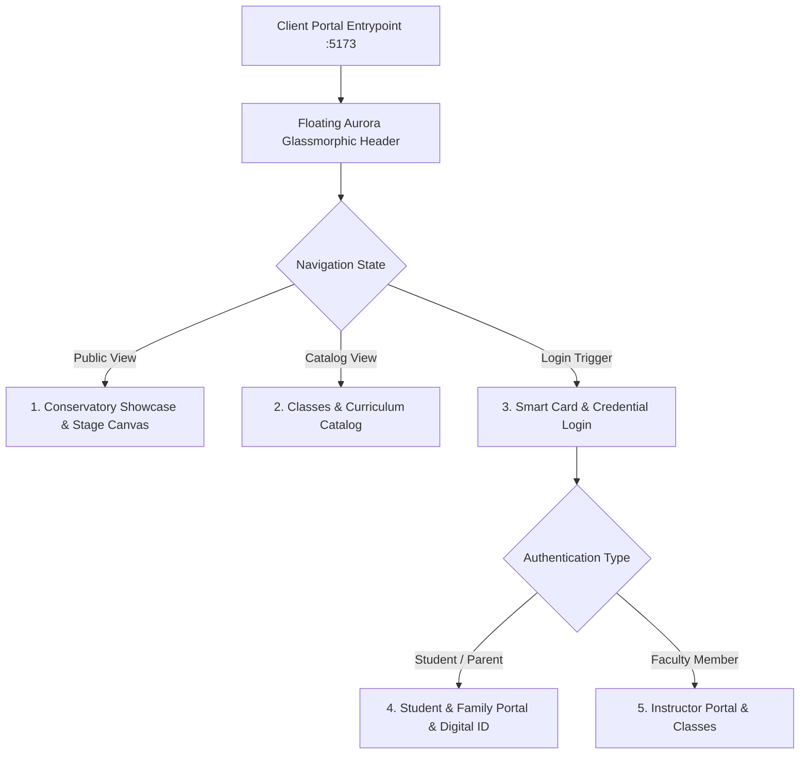

# 🩰 Étoile Platform — Client & Student Portal User Manual

The **Client & Student Portal** (`http://localhost:5173`) provides an elegant, French-conservatory inspired digital environment for prospective students, enrolled dancers, families, and faculty instructors. It runs on Vite 5 and React 18, featuring seamless bilingual support (English and Arabic), dark-mode conservatory aesthetics, real-time timetable countdowns, canvas barcode generation, and multi-factor authentication.

---

## 1. Portal Views Overview

The portal automatically adjusts its interface depending on the user's authentication state and active navigation view:



---

## 2. Public Landing Page & Visual Architecture (`LandingPage.tsx`)

The landing page provides a premier showcase of the academy's heritage, artistic philosophy, curriculum, faculty, and performance season, driven in real time by the **Portal Content CMS** and elevated by modern visual components.

### 2.1 Floating Glassmorphic Header (`AppHeader.tsx`)
- **Aurora Aesthetic**: Features dynamic scroll adaptation — seamlessly transitions from a transparent hero header into a floating dark-glass pill (`backdrop-blur-md`, subtle golden borders `rgba(202,168,104,0.2)`).
- **Academy Emblem**: Gold insignia with a delicate breathing animation pulse indicating live academy operational status.
- **Bilingual & Navigation Controls**: 1-click English/Arabic switcher (`dir="ltr"` / `dir="rtl"`), navigation anchor links, and an **"Access Portal"** quick-action button.
- **Mobile Drawer**: Smooth slide-over navigation sheet for mobile viewports.

### 2.2 Stage Atmosphere Particle Canvas (`StageAtmosphereCanvas.tsx`)
- An interactive, hardware-accelerated HTML5 Canvas particle simulation.
- Generates golden stage dust motes and soft ambient spotlight cones reacting to viewport movement, evoking the atmosphere of the Paris Opéra Garnier stage.

### 2.3 Interactive Onboarding Stepper (`OnboardingChecklist.tsx`)
- A personalized checklist component displayed to newly enrolled dancers and their parents.
- **Interactive Steps**:
  1. **Activate Smart Badge**: Verify conservatory card code (`ETOILE-XXXXXX`).
  2. **Set Private Password**: Complete initial verification via WhatsApp temporary code.
  3. **Explore Assigned Curriculum**: Review studio hall, attire requirements, and schedule.
  4. **Connect on WhatsApp**: Instant link to the academy's official WhatsApp channel.
  5. **Download Digital Pass**: Export high-resolution Code128 barcode ID to phone wallet.

### 2.4 Landing Page Core Sections:
1. **Conservatory Hero Banner**:
   - High-impact editorial typography with tiered headlines (e.g., *ÉTOILE BALLET ACADEMY — Perfection in Movement*).
   - Dynamic CTA buttons: **"Enroll for Audition"** (opens `EnrollModal`) and **"Explore Curriculum"** (navigates to `ClassesCatalogPage`).
2. **Global Broadcast Notice**:
   - Optional top banner for urgent announcements (e.g., *Spring Audition Registrations Open*).
   - Supports 3 visual severities: `info` (blue-gray), `gold` (conservatory amber), and `warning` (rose).
3. **Heritage & Pedagogical Philosophy**:
   - Highlights the academy's Vaganova, French, and Balanchine training foundations with live metric counters.
4. **Curriculum Showcase**:
   - Interactive program cards for **Classical Ballet**, **Contemporary Dance**, and **Youth Academy**.
   - Clicking **"View Syllabus & Details"** opens `ProgramModal` revealing class frequencies, age brackets, tuition rates, and training privileges.
5. **Distinguished Faculty Roster**:
   - Showcases Master Teachers, Prima Ballerinas, and Resident Choreographers with bios.
6. **Performance Season & Box Office**:
   - Calendar cards for major stage productions with status indicators: `upcoming`, `sold_out`, and `box_office`.
7. **Footer & Quick Navigation**:
   - Academy contact information, physical campus addresses (Paris Opera, Cairo Zamalek), social links, and legal notices.

---

## 3. Classes & Curriculum Catalog (`ClassesCatalogPage.tsx`)

A dedicated catalog allowing prospective and existing dancers to explore the full conservatory schedule.

### Key Capabilities:
- **Interactive Program Filter**: Toggle instantly between *All Disciplines*, *Classical Ballet*, *Contemporary Dance*, and *Youth Academy*.
- **Course Detail Cards**:
  - Course code (e.g., `BAL-CL-101`) and full title in active language.
  - Assigned studio room (e.g., *Grand Studio Petipa*, *Studio Pavlova*).
  - Weekly schedule days and exact hours (e.g., *Mon, Wed, Fri — 16:00 to 17:30*).
  - Assigned master instructor with avatar badge.
  - Enrollment capacity gauge displaying current availability.
- **Direct Class Audition Trigger**: Clicking **"Audition for this Class"** launches `EnrollModal` pre-filled with the selected course code and discipline.

---

## 4. Enrollment & Audition Modal (`EnrollModal.tsx`)

A streamlined lead capture system that connects prospective dancers directly into the academy's administrative CRM.

### Form Fields & Validation:
- **Dancer Full Name**: Prospective student's name.
- **Dancer Age**: Enforces age bracket alignment.
- **Parent / Guardian Name**: Contact person for minor dancers.
- **Parent WhatsApp Phone Number**: Required for automated audition confirmations.
- **Parent Email Address**: Billing and documentation contact.
- **Target Program**: Pre-selected from the clicked program or class card.
- **Prior Dance Experience**: Text area documenting previous school training, years en pointe, or syllabus level.

### Processing Pipeline:
1. Submits payload to `POST /api/leads`.
2. Creates a new record in `AdmissionLead` with stage `new_inquiry`.
3. Displays a confirmation modal informing the parent that an audition confirmation has been scheduled.
4. Generates an instant notification in the staff CRM.

---

## 5. Multi-Modal Authentication (`ClientLoginPage.tsx`)

The login portal allows students, parents, and faculty to authenticate quickly using their preferred credential:

```mermaid
graph TD
    LoginEntry[Client Login Page] --> TabChoice{Authentication Method}
    TabChoice -->|Method A| CardScan[1. Smart Card Barcode / RFID Code]
    TabChoice -->|Method B| StudentCreds[2. Student ID / Parent Phone or Email]
    TabChoice -->|Method C| DemoHelper[3. 1-Click Demo Cards Drawer]

    CardScan --> CardSubmit[POST /api/auth/card-login]
    StudentCreds --> CardSubmit
    DemoHelper --> CardSubmit

    CardSubmit --> FirstLoginCheck{isFirstLogin == true?}
    FirstLoginCheck -->|Yes| SetupFlow[First-Time WhatsApp Password Setup]
    FirstLoginCheck -->|No| PortalDirect[Direct Portal Entry (Student & Family Context)]
```

### 5.1 Smart Card, Student ID & Parent Credential Login
- **Students and Instructors**: Authenticate using physical card code (`ETOILE-892101` or `INS-01`).
- **Parents**: Log in directly using their student's credentials:
  - Student card barcode (`ETOILE-XXXXXX`)
  - Student ID (`STU-XXX`)
  - Registered parent email
  - Registered parent phone
  paired with the student's password.
- **Unified Context**: Authentication loads both the individual student's pedagogical progress and the complete family household data (invoices, pay links, siblings, schedules) without requiring a separate, insecure passwordless family login.

### 5.2 First-Time Password Setup via WhatsApp
1. If the student has never logged in before (`isFirstLogin: true`), entering the card code prompts the user to verify their identity.
2. Clicking **"Send Temporary Code to WhatsApp"** calls `POST /api/auth/request-initial-password`.
3. The server generates a temporary code and dispatches it to the parent's registered WhatsApp.
4. The dancer/parent enters the temporary code, sets a new private password, and is automatically logged in.

### 5.3 Forgot Password & OTP Recovery
- Dancers or parents who forgot their password click **"Forgot Password?"**.
- The system dispatches a 6-digit numeric OTP to the registered WhatsApp number.
- Entering the valid OTP allows immediate password reset without administrator intervention.

### 5.4 1-Click Demo Cards Drawer
For evaluation and testing, the login screen includes a quick-fill drawer with seeded accounts:
- **Maya Moreau** (`ETOILE-892101`): Classical Pre-Pro dancer with active quota.
- **Leo Moreau** (`ETOILE-892102`): Youth dancer testing first-time setup flow.
- **Lucas Marchand** (`INS-01`): Faculty instructor testing teacher portal.

---

## 6. Student & Family Portal (`ClientPortal.tsx`)

The personal self-service dashboard for enrolled dancers and their parents.

### 6.1 Digital Conservatory ID Card (`BarcodeRenderer.tsx`)
- Displays dancer's official photo, full name (bilingual), student ID, and conservatory level.
- **Code128 Standard Barcode**: Rendered natively on an HTML5 canvas based on the student's unique barcode number (`ETOILE-XXXXXX`).
- **QR Code**: Rendered alongside for camera scanning terminals.
- **Export & Print**: Dancers can click **"Download ID Badge"** to save a high-resolution PNG image for their mobile wallet or print a physical conservatory badge.

### 6.2 Real-Time Schedule & Class Countdown
- Displays the student's next scheduled class session.
- Features a **live countdown timer** (e.g., *Class starts in 2 hours, 14 minutes*).
- Details the exact studio hall (*Grand Studio Petipa*), teaching ballet master, and attire requirements.

### 6.3 Subscription Quota & Expiry Tracker
- **Session Progress Bar**: Visually indicates classes attended vs total classes purchased (e.g., *14 of 16 Classes Attended*).
- **Expiration Date**: Displays contract end date with a countdown of remaining days.
- **Quota Warning Alert**: If remaining sessions drop to 2 or fewer, a gold warning banner prompts the dancer to renew their package.

### 6.4 Student Wallet Balance & Debt Settlement
- **Account Ledger**: Shows real-time balance. Positive values represent available credit; negative values indicate outstanding debt (e.g., *Debt: -650 EGP / -650 ج.م*).
- **Overdraft Limit**: Shows allowable debt ceiling (e.g., *Max Negative Limit: 1,500 EGP / 150 €*).
- **1-Click Debt Settle Modal**: Allows parents to simulate clearing outstanding tuition debt via Card, Bank Transfer, or Cash at the front desk.

### 6.5 Historical Attendance Records
- Chronological timeline of all past check-ins.
- Badges indicating whether access was `granted`, `late`, or `denied`.
- Hardware method indicator: `hid_barcode` (physical laser scanner) or `qr_camera` (tablet camera).

### 6.6 Faculty Evaluations & Progress Notes
- Displays technical ballet ratings from master teachers across 4 core criteria (0.0 to 10.0):
  1. **Barre Technique**: Turnout, alignment, extension, and foot articulation.
  2. **Center Work**: Adagio control, pirouettes, and balance en pointe.
  3. **Allegro & Elevation**: Grand allegro jumps, batterie, and landing softness.
  4. **Musicality & Artistry**: Phrasing, epaulement, expression, and stage presence.
- Official commentary notes from the Artistic Director.

### 6.7 Household Invoicing & Digital Pay-Links (`PayLinkButton.tsx`)
- Displays family invoices with payment status (`pending`, `paid`, `cancelled`).
- **1-Click Digital Payment**: Parents can click **"Pay Online"** to generate an instant pay-link via Paymob (Credit/Debit cards), Fawry (reference pay codes), or InstaPay.
- Automatically reconciles invoice balance upon webhook confirmation without front-desk waiting.

---

## 7. Faculty & Instructor Portal (`InstructorPortal.tsx`)

When an instructor logs in with their staff credentials or card code (`INS-01`), the portal renders the **Faculty Portal**.

### Key Capabilities:
1. **Faculty Overview**:
   - Instructor name, pedagogy department (*Contemporary Pedagogy*), and assigned studio halls.
2. **Weekly Teaching Timetable**:
   - Displays all assigned course sessions for the current week.
   - Indicates session status: `scheduled`, `completed`, or `cancelled`.
3. **Enrolled Dancers Roster**:
   - Displays real-time student count enrolled in each course (e.g., *14 Dancers Enrolled / Cap 18*).
4. **1-Click WhatsApp Session Reminders**:
   - Faculty can click **"Send Session Reminder"** to trigger automated WhatsApp notifications to all enrolled dancers 60 minutes prior to class.
5. **Class Broadcast Announcement**:
   - Allows instructors to type a custom rehearsal announcement (e.g., *"Please bring character skirts and shoes for Act II rehearsal"*), which dispatches to all dancers' WhatsApp contacts.
