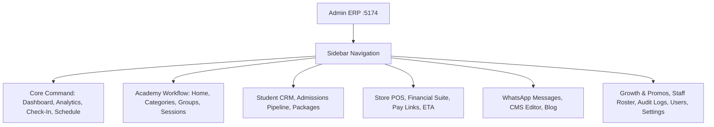
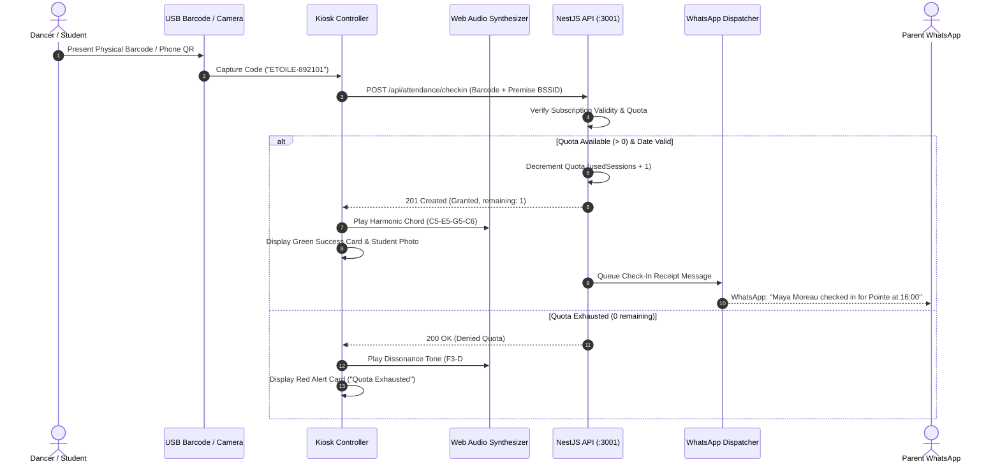

# 🏛️ Étoile Platform — Admin CRM & Operations ERP Manual

The **Admin & Operations ERP** (`http://localhost:5174`) is the operational command center of Étoile Ballet Academy. It equips Artistic Directors, Owners, Receptionists, and Department Heads with comprehensive tools for attendance check-ins, student lifecycle CRM, boutique retail POS, curriculum scheduling, automated WhatsApp notifications, portal CMS editing, and staff administration.

---

## 1. System Navigation & Keyboard Shortcuts

The ERP features an intuitive, role-aware sidebar navigation with persistent state and rapid accessibility shortcuts:

### Operational Modules Roster (22 Tabs):
1. `overview`: **Executive Dashboard** — Pulse, real-time MRR, studio status, and urgent alerts.
2. `analytics`: **Analytics & Intelligence** — Trailing trends, revenue recognition, program mix, and forecasts.
3. `checkin`: **Check-In Kiosk** — Sub-second scanning, audio chimes, premise WiFi, and offline queue.
4. `schedule`: **Studio Schedule** — Week grid, room occupancy, and automated conflict detection.
5. `courses`: **Academy Home** — 3-step hierarchy overview, legacy courses, and faculty workload.
6. `categories`: **Categories** — Top-level artistic disciplines and age divisions.
7. `groups`: **Groups** — Cohorts with lead instructors and student rosters.
8. `sessions`: **Sessions** — Class calendar timetable with pre-session WhatsApp notifications.
9. `students`: **Students CRM** — Full dancer profiles, wallets, evaluations, medical notes.
10. `admissions`: **Admissions Pipeline** — Lead capture, audition scheduling, and 1-click conversion.
11. `subscriptions`: **Packages & Quotas** — Plan configurations, remaining sessions, and renewals.
12. `pos`: **Boutique POS** — Uniforms, pointe shoes, variant matrix, and debt ledger checkout.
13. `financials`: **Financial Command** — IFRS-15 daily accruals, P&L, AR aging, payroll, cash shifts, pay-links.
14. `openwa`: **WhatsApp Dispatcher** — Gateway status, QR pairing, automated templates, audit log.
15. `cms`: **Website CMS** — Live visual editor for public portal branding, hero copy, faculty, and season.
16. `blog`: **Blog Manager** — Conservatory news, audition calls, and press publishing.
17. `growth`: **Growth & Referrals** — Student referral tracking, promo codes, and discount policies.
18. `roster`: **Staff Roster & Shifts** — Shift scheduling, reception duties, and leave governance.
19. `audit`: **Audit Log** — Comprehensive security, CRM, and financial audit trails.
20. `users`: **Administrators & Staff** — Staff accounts, RBAC role assignment, and card bindings.
21. `settings`: **Settings Hub** — Multi-branch campus management (`Zamalek`, `New Cairo`), academic years, ETA tax setup.
22. `my_profile`: **My Profile** — Staff credential management and personal duty status.

### Power-User Keyboard Shortcuts:
- **`Cmd + B`** / **`Ctrl + B`**: Toggle sidebar collapse/expand.
- **Keys `1` through `8`**: Instant shortcut to switch between permitted operational modules.

---

## 2. Dashboard Overview (`DashboardOverview.tsx`)

The central executive cockpit providing instantaneous operational metrics, studio status, and urgent alerts.

### Key Components:
1. **Live Paris Conservatory Clock**:
   - Accurately tracks European Conservatory Time (`Europe/Paris`) to seconds, ensuring synchronization across international branches.
2. **Executive KPI Cards**:
   - **Monthly Recurring Revenue (MRR)**: Real-time subscription and enrollment revenue with month-over-month growth trends.
   - **Active Dancers**: Current enrolled student population across Classical, Contemporary, and Youth divisions.
   - **Today's Check-Ins**: Real-time counter of dancers who have successfully passed through the attendance kiosk today.
   - **Studio Occupancy Rate**: Percentage of studio hall hours currently occupied by scheduled classes.
3. **Live Studio Room Indicators**:
   - Visual status badges for each conservatory dance hall (*Grand Studio Petipa*, *Studio Pavlova*, *Studio Nijinsky*) indicating active rehearsals and ongoing classes.
4. **Quick Action Shortcuts**:
   - Immediate navigation buttons to **"Launch Fast-Track Check-In"**, **"Register New Dancer"**, **"Open Boutique POS"**, and **"Log Studio Expense"**.

---

## 3. Fast-Track Attendance Check-In Kiosk (`FastTrackCheckIn.tsx`)

A sub-second, hardware-integrated attendance kiosk engineered for peak arrival rush hours before class commencement.

### Key Technical Capabilities:
- **USB HID Keyboard Emulation**: Listens globally for high-speed keystroke bursts from laser barcode scanners. Operators do not need to click or focus any input field.
- **WebRTC Camera Scanner**: Enables front-desk tablets or laptops to scan QR codes via the front/rear device camera.
- **Manual Input Modal**: Allows receptionists to enter a student barcode or ID manually in case of lost or damaged badges.
- **Premise WiFi Geofence Lock**: Verifies the kiosk terminal network against the authorized conservatory BSSID (`Etoile-Secure-5G [F4:92:BF:11:80:A2]`).
- **Zero-Latency Audio Synth**: Employs the native browser `AudioContext` to synthesize instant harmonic audio feedback without downloading audio files.
- **Automated WhatsApp Parent Receipts**: As soon as access is granted, the backend automatically dispatches a check-in receipt to the parent's registered mobile number.
- **Offline Resiliency & Queue Synchronization (`offlineQueue.ts`)**:
  - In the event of network disruption at reception, scans are preserved in `localStorage` with client-generated UUID idempotency keys.
  - A visual banner indicates `Offline Mode (X pending scans)`.
  - When connection is restored, the queue auto-flushes every 8 seconds via idempotent `POST /api/attendance/checkin`, ensuring zero duplicate quota deductions.

---

## 4. Courses & Curriculum Management (`CourseManagement.tsx`)

The pedagogical timetable and course administration engine.

### Key Capabilities:
1. **Course Creation & Syllabus Management**:
   - Create and edit courses with bilingual titles (`title`, `titleAr`), detailed repertoire descriptions, and program tiers (`classical`, `contemporary`, `youth`).
   - Define student capacity limits with automated enrollment caps.
   - Assign primary faculty instructors from the staff roster.
   - Designate recurring weekly days and studio rooms (*Studio Petipa*, *Studio Pavlova*, *Studio Nijinsky*).
2. **Student Enrollment Manager**:
   - 1-click student enrollment and unenrollment modal.
   - Live capacity tracking (e.g., *14 / 15 Enrolled — 1 Spot Left*).
3. **Session Calendar & Scheduling**:
   - Generate individual calendar sessions for specific dates and times.
   - Attach attire, pointe shoe, or rehearsal notes (e.g., *Bring white romantic tutu skirt*).
4. **Automated WhatsApp Pre-Session Reminders**:
   - Configure pre-session notification windows (15, 30, 45, 60, 90, or 120 minutes before class).
   - Edit bilingual message templates with dynamic variable tokens (`{studentName}`, `{courseTitle}`, `{time}`, `{studio}`, `{instructorName}`).
   - **"Send Reminders Now"**: Manually triggers batch reminders to all enrolled students for any selected session.
5. **Class Broadcast Messaging**:
   - Broadcast emergency schedule changes, masterclass notices, or rehearsals directly to all dancers enrolled in a course.

---

## 5. Student CRM & Admissions Pipeline (`StudentCrm.tsx`, `StudentProfilePage.tsx`)

A comprehensive student management system covering the entire dancer lifecycle from initial audition inquiry to conservatory graduation.

### 5.1 Student Directory
- Fast full-text search across dancer names, parent names, email, and barcode codes.
- Filter by discipline (*Classical*, *Contemporary*, *Youth*), conservatory level, and financial debt status.
- Export student roster data.

### 5.2 Full Student Profile View
- **Demographic & Household**: Dancer age, emergency phone, parent contact, and linked household ID.
- **Digital Barcode & ID Card**: Live Code128 barcode rendering on HTML5 canvas with high-resolution PNG download and print capabilities.
- **Wallet Ledger & Debt Allowance**:
  - Live account balance (positive credit or negative debt).
  - Configurable maximum debt ceiling (e.g., *Max Negative Limit: 1,500 EGP / 150 €*).
  - Quick-action balance adjustment modal.
- **Active Subscriptions**: Displays current package, remaining sessions, daily accrual rate, and expiration countdown.
- **Historical Attendance Timeline**: Audit log of every check-in event with timestamp and device verification method.
- **Pedagogical Notes**: Categorized notes repository for staff (*General*, *Medical & Injury*, *Performance & Repertoire*, *Tuition & Invoicing*).
- **Artistic Skill Evaluation Rubrics**: Technical scores (0.0 to 10.0) across *Barre*, *Center*, *Allegro*, and *Musicality*, with master teacher notes.

### 5.3 Admissions Lead Pipeline (Kanban & Table)
- Inquiries submitted from the public website's `EnrollModal` flow directly into the **Admissions Pipeline**.
- **Stages**:
  1. `new_inquiry`: Initial web lead received.
  2. `audition_scheduled`: Dancer invited to conservatory studio audition.
  3. `evaluated`: Artistic Director has reviewed dancer's anatomical turnout and musicality.
  4. `enrolled`: Dancer accepted into the academy.
  5. `rejected`: Not accepted at this time.
- **1-Click Conversion to Student**: Clicking **"Convert to Student"** creates a registered `Student` record, assigns an initial subscription package, generates a unique barcode badge, and archives the lead.

---

## 6. Subscriptions & Package Manager (`SubscriptionManager.tsx`)

Manages the academy's class package plans, student quotas, and revenue recognition simulations.

### Key Capabilities:
- **Subscription Package Catalog**:
  - Create and edit package tiers (e.g., *Conservatory Classical Elite — 16 Classes / 30 Days / 4,800 EGP (480 €)*).
  - Set session quotas, duration in days, and discipline requirements.
- **Student Quota Overrides**:
  - Manually grant extra classes or extend validity expiration dates for dancers with medical excuses.
- **Revenue Recognition Simulator**:
  - Evaluates daily accrual allocation for any package price and duration based on the platform's accounting formula ($R_d = \frac{P}{T_{days}}$).

---

## 7. Store & Boutique POS (`PosBoutique.tsx`)

The retail point-of-sale system managing academy uniforms, pointe shoes, tights, and accessories.

### Key Capabilities:
1. **Multi-Size Variant Inventory Matrix**:
   - Tracks stock at the individual size level (e.g., *Grishko 2007 Pro: 36 XXX = 12 in stock, 37 XXX = 8 in stock*).
   - Real-time stock decrement upon checkout.
   - Low-stock visual warning badges.
2. **Visual Product Catalog & SKU Search**:
   - Category filtering (*Pointe Shoes*, *Leotards*, *Tights*, *Accessories*).
   - Instant SKU barcode lookup for hardware scanner compatibility.
3. **Cart & Multi-Tender Checkout**:
   - Fast cart addition with size variant selection.
   - **Tender Options**:
     - **Cash**: Updates cash sales and expected cash in the active cash drawer shift.
     - **Card**: Electronic terminal processing.
     - **Bank Transfer**: Records reference number.
     - **Student Wallet Debt**: Charges purchase directly to the student's account ledger, checking against their `maxNegativeDebt` ceiling.
4. **Order History & Receipts**:
   - Itemized purchase logs with printable receipt generation.

---

## 8. WhatsApp Messages & Gateway Manager (`OpenWaDispatcher.tsx`)

The central management interface for the academy's WhatsApp communication infrastructure.

### Key Capabilities:
- **Gateway Status Monitor**: Displays current connection status (`connected`, `pairing`, `disconnected`), connected phone number, and last heartbeat.
- **Pairing Engine**:
  - Supports **Built-in QR Engine** (generates pairing QR in browser) and **External Gateway Bridge** (integrates with external Baileys/OpenWA server).
- **Live Message Audit Queue**:
  - Chronological log of all outbound messages with recipient phone, student name, trigger event, and delivery status (`dispatched`, `delivered`, `failed`).
  - **Retry Action**: 1-click retry for failed notifications.
- **Manual Message Dispatcher**:
  - Allows staff to send immediate ad-hoc WhatsApp messages to any student or parent phone number.

---

## 9. Website & Portal CMS Editor (`PortalCmsEditor.tsx`)

A real-time, zero-downtime visual content management system controlling the public website and portal.

### Editable Sections:
1. **Academy Branding**: Academy name (EN/AR), taglines, phone, email, website URL, physical addresses, and social links.
2. **Hero Presentation**: Headline tiers (Lines 1, 2, 3 in EN/AR), subtitles, CTA button text, and hero background image link.
3. **Sitewide Announcement Banner**: Toggle notice active/inactive, customize message copy, and set severity level (`info`, `gold`, `warning`).
4. **Curriculum Programs**: Add, edit, or reorder programs, including titles, tuition pricing, age groups, schedules, and bulleted features.
5. **Faculty Roster**: Add, modify, or remove instructors, uploading photo URLs, professional titles, and career biographies.
6. **Performance Season**: Manage stage events, venues, dates, and box office ticket statuses.
7. **1-Click Factory Reset**: Restores CMS content back to canonical conservatory defaults if needed.

---

## 10. Administrators & Staff User Management (`AdminUsersManagement.tsx`)

Enterprise user management and Role-Based Access Control (RBAC).

### Key Capabilities:
- **Staff User Directory**: View all administrative and pedagogical accounts with their assigned roles and departments.
- **Create Staff Member**: Register new users with email, temporary password, department, and physical RFID card code (`cardCode`).
- **Role Assignment**: Assign roles with strict permission boundaries (`superadmin`, `owner`, `receptionist`, `instructor`).
- **On-Duty Shift Status**: Toggle active receptionist or instructor shift status.
- **Password Reset**: Administrators can issue secure password resets for staff members.
- **Self-Deletion Protection**: Guards prevent logged-in administrators from accidentally deleting their own account.

---

## 11. Analytics & Business Intelligence Hub (`AnalyticsHub.tsx`)

A dedicated data intelligence view synthesizing live performance metrics from PostgreSQL.
- **Revenue Trajectories**: Visual bucketed revenue trends across 30-day, 90-day, and 12-month windows.
- **Program Mix Distribution**: Percentage share of enrollment between Classical Ballet, Contemporary Dance, and Youth Division.
- **Predictive Forecasting**: 3-month conservative, base, and optimistic revenue forecasts calculated from historical recognized daily accruals.
- **Action Watchlists**: Identifies low-quota dancers (≤ 2 sessions remaining), tuition debtors, and expiring contracts for front-desk follow-up.

---

## 12. Studio Schedule Board & Conflict Prevention (`ScheduleBoard.tsx`)

Timetable orchestration across all dance studios.
- **Weekly Schedule Grid**: Visual timeline of studio occupancy for *Grand Studio Petipa*, *Studio Pavlova*, and *Studio Nijinsky*.
- **Automated Conflict Detection**: Evaluates non-cancelled sessions via `GET /api/ops/schedule-conflicts` to flag double-booked studio halls or instructors overlapping in time.
- **Pre-Session Notifications**: Trigger manual or scheduled WhatsApp reminders directly from the board.

---

## 13. Academy Hierarchy: Categories, Groups & Sessions (`AcademyView.tsx`)

A 3-step structured curricular model:
1. **Step 1 — Categories**: Define curriculum disciplines (e.g., *Pre-Professional Division*, *Youth Program*).
2. **Step 2 — Groups**: Form student cohorts within categories and assign primary ballet masters (`leadInstructorId`).
3. **Step 3 — Sessions**: Schedule individual studio classes linked to groups with automated enrollment tracking.

---

## 14. Admissions Pipeline Board (`AdmissionsPipeline.tsx`)

A dedicated Kanban board tracking prospective student inquiries:
- **Pipeline Stages**: `new_inquiry` → `trial_scheduled` → `evaluated` → `enrolled` → `rejected`.
- **SLA Watch**: Highlights leads older than 48 hours requiring staff follow-up (`GET /api/ops/funnel-sla`).
- **1-Click Conversion**: Automatically instantiates a `Student` record, assigns a barcode card, provisions a subscription plan, and links the family household.

---

## 15. Staff Roster & Shifts (`RosterView.tsx`)

Front-desk and faculty operational duty management.
- **Shift Scheduling**: Assign duty hours (`09:00` - `17:00`) and operational stations (*Reception desk*, *Studio floor manager*, *Masterclass coach*).
- **Leave Requests**: Review and approve/reject staff vacation or emergency absence applications.

---

## 16. Growth, Referrals & Promo Codes (`GrowthView.tsx`)

Academy expansion and customer loyalty toolkit.
- **Referral Tracking**: Monitor which families have referred new students and track reward eligibility.
- **Promo Code Generator**: Issue percentage or fixed-amount vouchers for workshops and uniform purchases with expiry bounds and usage limits.

---

## 17. Conservatory Blog & Press Manager (`BlogManager.tsx`)

Bilingual publishing engine for public conservatory announcements, performance season reviews, and audition dates.
- Rich text markdown editing with English and Arabic translations.
- Cover photography upload and automated SEO slug generation.

---

## 18. System Security & Audit Log (`AuditLogView.tsx`)

Immutable activity trail capturing sensitive administrative events:
- Security events (staff logins, role changes, password resets).
- CRM actions (debt overrides, manual quota additions, lead conversions).
- Financial events (invoice cancellations, journal vouchers, drawer shift closures).

---

## 19. Academy Settings Hub (`SettingsHub.tsx`)

Conservatory-wide system configuration:
- **Multi-Campus Management**: Configure physical branch locations (`Zamalek`, `New Cairo`) with contact information and main campus flags.
- **Academic Years**: Define term calendars (`2025/2026`) and execute seamless year rollover.
- **Tax Authority Integration**: Egyptian Tax Authority (ETA) e-receipt taxpayer ID, issuer code, and environment switches.
- **Payment Gateways**: Configure Paymob, Fawry, and InstaPay credentials.
- **WhatsApp Gateway Settings**: Manage provider bridge parameters and secret redaction toggles.

