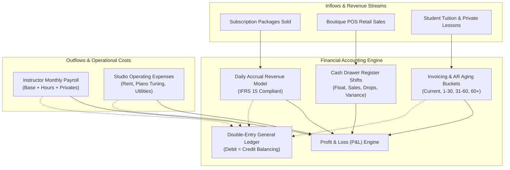
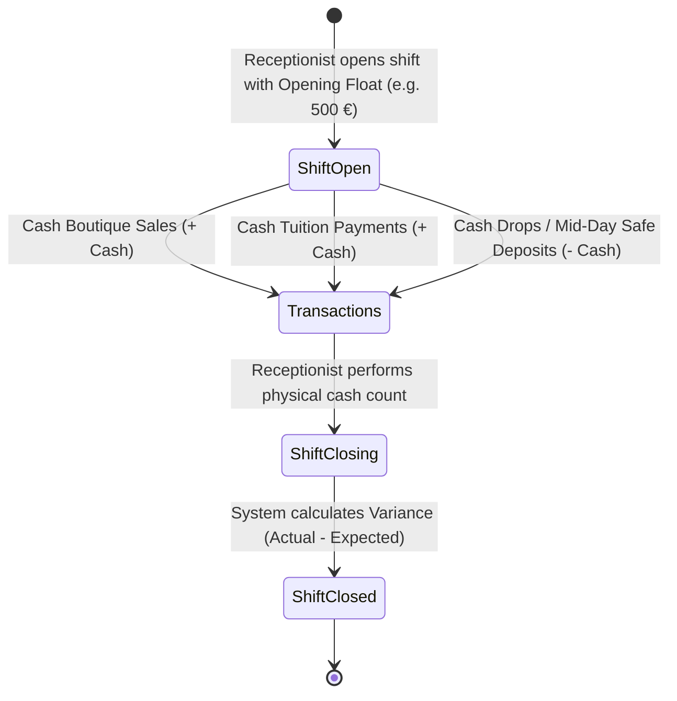

# 💰 Étoile Platform — Financial Accounting Suite & Algorithms

This document details the financial architecture, revenue recognition models, double-entry bookkeeping rules, and accounting workflows built into the Étoile Ballet Academy platform. The system adheres to international accounting principles (**IFRS 15 / ASC 606**) for deferred subscription revenue and provides front-desk cash drawer governance.

---

## 1. Financial Architecture Overview

The financial suite consists of seven interconnected subsystems managed within the `/admin` portal and backed by the NestJS `AccountingModule`:

---

## 2. Subscription Revenue Recognition & Daily Accrual Model

### 2.1 The Accounting Challenge
In performing arts academies, students purchase class packages (e.g., *16 Classes for 480.00 € over 30 days*) that frequently span across calendar months (e.g., from August 15 to September 14).
- **Cash Basis Accounting** incorrectly recognizes the full 480.00 € in August, distorting profitability and leaving September with zero recognized revenue despite ongoing instruction costs.
- **Accrual Accounting (IFRS 15)** requires revenue to be recognized proportionally as the performance obligation is satisfied over time, treating unearned amounts as **Deferred Revenue (Contract Liability)**.

### 2.2 The Mathematical Formula
The platform calculates revenue on a strict **pro-rata daily accrual basis**:

$$\text{Daily Accrual Rate } (R_d) = \frac{\text{Plan Purchase Price } (P)}{\text{Total Contract Days } (T_{days})}$$

$$\text{Recognized Revenue } (R_{rec}) = R_d \times \text{Elapsed Days } (D_{elapsed})$$

$$\text{Deferred Revenue } (R_{def}) = P - R_{rec}$$

### 2.3 Concrete Example
A dancer purchases the *Conservatory Classical Elite* package on **August 15, 2026**:
- **Price ($P$)**: $4,800\text{ EGP}$ (or $480.00\text{ \euro}$)
- **Contract Duration ($T_{days}$)**: $30\text{ days}$ (expires September 14, 2026)
- **Daily Rate ($R_d$)**: $\frac{4,800}{30} = 160.00\text{ EGP / day}$ (or $16.00\text{ \euro / day}$)

At the close of August (17 elapsed days: Aug 15 to Aug 31):
- **August Recognized Revenue**: $160.00 \times 17 = 2,720.00\text{ EGP}$ ($272.00\text{ \euro}$) (Credited to Revenue)
- **August Deferred Revenue**: $4,800.00 - 2,720.00 = 2,080.00\text{ EGP}$ ($208.00\text{ \euro}$) (Held as Unearned Revenue contract liability)

In September (remaining 13 days: Sep 1 to Sep 14):
- **September Recognized Revenue**: $160.00 \times 13 = 2,080.00\text{ EGP}$ ($208.00\text{ \euro}$) recognized as performance obligations conclude.

---

## 3. Profit & Loss (P&L) Statement (`PnLStatementView.tsx`)

The P&L engine computes real-time profitability by aggregating recognized inflows against operational outflows:

### 3.1 Inflow Calculation
$$\text{Total Recognized Inflow} = \text{Recognized Subscriptions} + \text{Boutique Retail Gross Margin}$$
- **Recognized Subscriptions**: Sum of daily accrued revenue for all active contracts to date.
- **Boutique Retail Margin**: Gross boutique intake summed from `BoutiqueOrder` records (no cost baselines — empty books report zero).

### 3.2 Outflow Calculation
$$\text{Total Operational Outflow} = \text{Faculty Payroll} + \text{Studio OpEx}$$
- **Faculty Payroll**: Cumulative net remuneration from `PayrollRecord` entries for the academic term.
- **Studio OpEx**: Total verified expenditures from `Expense` records.

### 3.3 Net Profit
$$\text{Net Profit} = \text{Total Recognized Inflow} - \text{Total Operational Outflow}$$

### 3.4 Key Executive Metrics
- **Monthly Recurring Revenue (MRR)**: Subscription revenue earned inside the trailing 30-day window (overlap of each contract with `[now-30d, now]` × daily rate).
- **Churn Rate**: Share of subscriptions whose status is not `active` (expired by quota or date).
- **Quota Utilization Rate**: Percentage of purchased class sessions that dancers have physically attended ($\frac{\sum \text{usedSessions}}{\sum \text{maxSessions}} \times 100$).

---

## 4. Invoicing & Accounts Receivable Aging (`InvoicingAndArView.tsx`)

The Accounts Receivable (AR) module manages tuition billings, private coaching invoices, payment settlements, and aging debt.

### 4.1 Invoice Structure
- **Header**: Invoice number (`INV-XXXXXX`), student/family ID, customer name, issue date, due date, payment terms.
- **Itemized Lines (`InvoiceLineItem`)**: Description, quantity, unit price, subtotal.
- **Taxes & Totals**: Applicable VAT rate, subtotal, tax amount, and final total.
- **Settlement Tracking**: `amountPaid`, `remainingDue`, and status (`unpaid`, `partially_paid`, `paid`, `overdue`, `cancelled`).

### 4.2 AR Aging Buckets
The system categorizes all outstanding unpaid balances into standardized aging buckets:

| Aging Bucket | Overdue Period | Urgency Level | Automated Operational Action |
| :--- | :--- | :--- | :--- |
| **Current** | $0\text{ days}$ (Not yet due) | Normal | Standard invoice issued; due date pending |
| **1 — 30 Days** | $1 \text{ to } 30\text{ days overdue}$ | Notice | Friendly WhatsApp statement sent to parent |
| **31 — 60 Days** | $31 \text{ to } 60\text{ days overdue}$| Warning | Formal tuition reminder; front-desk notice flagged |
| **Over 60 Days** | $> 60\text{ days overdue}$ | Critical | Account suspended; check-in kiosk denies entry |

### 4.3 Multi-Channel Payment Recording
Staff can record invoice settlements across multiple payment rails:
- `cash`: Enters the active front-desk cash drawer shift.
- `card`: Credit/debit card terminal transaction.
- `bank_transfer`: Direct bank transfer with reference code.
- `fawry` / `instapay`: Regional instant payment gateways.

---

## 5. Studio Operating Expense Tracker (`ExpenseTrackerView.tsx`)

Maintains financial control over all conservatory operating disbursements.

### 5.1 Expense Categories
1. `studio_rent`: Facility lease and dance hall rental.
2. `piano_maintenance`: Regular tuning and acoustic maintenance of conservatory grand pianos.
3. `utilities`: Electricity, climate control, and water utilities.
4. `costumes_production`: Repertoire costumes, tiaras, and stage props for annual productions.
5. `cleaning_sanitization`: Specialized sprung marley floor cleaning and sanitization.
6. `marketing_social`: Digital campaigns and audition announcements.
7. `software_licenses`: Music licensing (SACEM), platform hosting, and accounting tools.
8. `administrative_legal`: Legal retained counsel and audit compliance.

### 5.2 Approval Workflow
- When staff submit an expense, it enters as `pending_audit`.
- Only `superadmin` or `owner` roles can update the status to `approved` or `rejected`.

---

## 6. Faculty & Instructor Payroll Calculator (`PayrollCalculatorView.tsx`)

Calculates complex monthly remuneration for ballet masters, accompanists, and guest choreographers.

### 6.1 Remuneration Formula
$$\text{Net Payable} = \text{Base} + (\text{HourlyRate} \times \text{HoursTaught}) + (\text{PrivateRate} \times \text{PrivatesCount}) + \text{Bonuses} - \text{Deductions}$$

- **Base Salary**: Fixed monthly compensation for resident artistic staff.
- **Group Hours Compensation**: Repertoire and group technique classes taught.
- **Private Coaching Compensation**: One-on-one competition coaching and variation preparation.
- **Bonuses**: Repertoire staging bonuses, student competition prizes.
- **Deductions**: Advance draws, tax withholdings.

### 6.2 Settlement Execution
Once reviewed, clicking **"Mark as Paid"** generates a unique local-rail transaction reference (CIB bank transfer or InstaPay, e.g., `CIB-982104`), updates the status to `paid`, and locks the record against further edits.

---

## 7. Double-Entry General Ledger (`GeneralLedgerView.tsx`)

Ensures complete accounting integrity via balanced double-entry journal vouchers.

### 7.1 Chart of Accounts (COA) Structure
| Account Code | Account Name | Type | Normal Balance |
| :--- | :--- | :--- | :--- |
| `1010` | Cash on Hand (Front Desk) | Asset | Debit |
| `1020` | Operating Bank Account | Asset | Debit |
| `1200` | Accounts Receivable (Tuition Due) | Asset | Debit |
| `1300` | Retail Boutique Inventory | Asset | Debit |
| `2010` | Accounts Payable (Suppliers) | Liability | Credit |
| `2100` | Deferred Subscription Revenue | Liability | Credit |
| `3010` | Academy Capital & Retained Earnings| Equity | Credit |
| `4010` | Classical Ballet Tuition Revenue | Revenue | Credit |
| `4020` | Boutique Retail Sales Revenue | Revenue | Credit |
| `5010` | Faculty Pedagogical Payroll Expense| Expense | Debit |
| `5020` | Studio Rent & Facilities Expense | Expense | Debit |
| `5030` | Piano & Floor Maintenance Expense | Expense | Debit |

### 7.2 Integrity Constraint
Every journal voucher enforces strict balancing before posting:

$$\sum \text{Debit Lines} = \sum \text{Credit Lines}$$

Any voucher where $\sum \text{Debits} \neq \sum \text{Credits}$ is rejected with a validation error.

---

## 8. Front-Desk Cash Drawer Shift Management (`CashDrawerShiftView.tsx`)

Provides strict financial governance over physical cash handled at the academy reception desk.

### 8.1 Opening a Shift
- The receptionist on duty enters their name and physical **Opening Float** (e.g., $500.00\text{ \euro}$ in coin and banknote change).
- The system generates a unique shift code (e.g., `SHIFT-2026-081`) with status `open`.

### 8.2 Real-Time Cash Accumulation
During the shift:
- Any boutique sale paid in cash increments `cashSalesTotal`.
- Any invoice settled in cash increments `cashSalesTotal`.
- Any mid-day deposit sent to the main safe is logged as a `cashDrop`.

### 8.3 Expected Cash Calculation
$$\text{Expected Cash} = \text{Opening Float} + \text{Cash Sales} - \text{Cash Drops}$$

### 8.4 Closing the Shift & Variance Reconciliation
At the end of the day:
1. The cashier physically counts the cash drawer banknotes and coins.
2. Enters `actualCashCounted`.
3. The system calculates the discrepancy:

$$\text{Variance} = \text{Actual Cash Counted} - \text{Expected Cash}$$

- **Zero Variance ($0.00\text{ \euro}$)**: Perfect cash drawer reconciliation.
- **Negative Variance**: Cash shortage requiring cashier explanatory notes.
- **Positive Variance**: Cash overage requiring investigation.
4. The shift status transitions to `closed`, locking all payment transaction ties.

---

## 9. Digital Payments & Pay-Links Gateway Engine (`PaymentLink`)

The academy supports omnichannel online settlement alongside in-person front-desk payments:

### 9.1 Multi-Provider Pay-Links
- **Gateways Supported**: Paymob (Cards, Mobile Wallets), Fawry (Reference payment codes), and InstaPay (Direct account transfer).
- **Link Generation**: Created via `POST /api/payments/paylink` with a 48-hour expiration window.
- **Dynamic Portal URL**: Embeds the unguessable crypto-random reference code (`PAYMOB-XXXXXX`).

### 9.2 Automated Webhook Reconciliation
1. Gateway notifies `POST /api/payments/webhook`.
2. The endpoint verifies provider reference authenticity.
3. Automatically marks the invoice as paid, records a `PaymentTransaction`, updates student ledger balances, and creates an audit entry without manual cashier intervention.

---

## 10. Egyptian Tax Authority (ETA) Electronic Receipt Compliance (`EtaDocument`)

Ensures statutory tax compliance for academy operations within Egypt:
- **B2C e-Receipts & B2B Invoices**: Auto-formatted to the required ETA JSON schema including unified tax registration numbers, issuer codes, item descriptions, and VAT tax buckets.
- **Drafting & Transmission Pipeline**:
  - `POST /api/eta/submit`: Prepares electronic invoice structure with tax calculations.
  - Automatically transitions from `draft` to `submitted` and records ETA receipt UUIDs upon validation.
- **Historical Audit Archive**: Full storage of raw signed request payloads and responses (`rawPayload`, `rawResponse`) for government tax inspection.

---

## 11. Multi-Campus Segment Reporting (Branches)

Allows financial controllers to analyze revenues and operational expenditures segregated by physical campus:
- **Campus Segment Allocation**: Every tuition invoice, POS boutique order, and instructor payroll record tracks the target campus branch (`Zamalek`, `New Cairo`).
- **Campus P&L**: Separate profitability, studio utilization, and average revenue per student (ARPU) metrics per facility.

